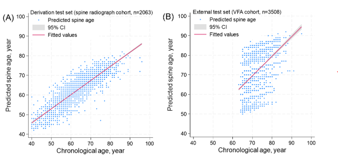
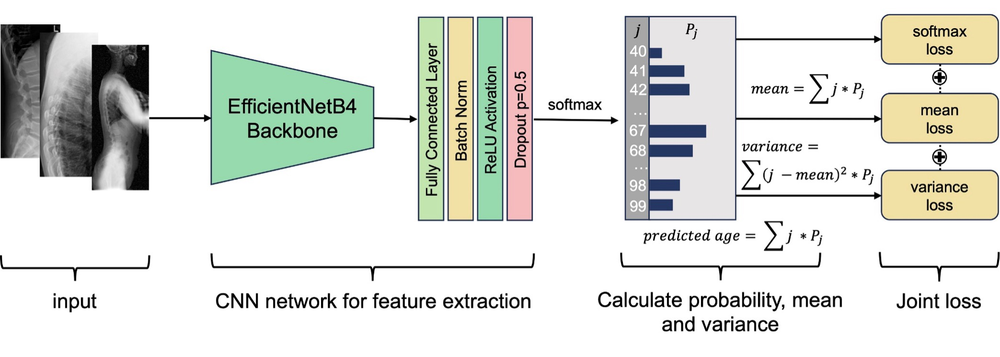

# VERTE-X-Aging
Code for "Spine age estimation using deep learning in lateral spine radiographs and DXA VFA to predict incident fracture and mortality." 

## Estimate Spine Age
In this study, we developed a convolutional neural network model to estimate spine age from lateral spine radiographs and dual-energy X-ray absorptiometry (DXA) vertebral fracture assessment (VFA) images. The discriminatory performance for prevalent vertebral fracture and osteoporosis was compared between biological spine age and chronological age. The prognostic value of the predicted spine age difference for incident fracture and mortality was assessed, adjusting for chronological age, sex, and other covariates.

     
    <em>Associations of chronological age and predicted spine age in the (A) derivation test set (spine radiograph cohort, aged 40 years or older, n=2063) and (B) external test set (DXA VFA cohort, aged 65 years or older, n=3508).</em>

## Image Processing

Due to intensity differences in individual images, histogram equalization was applied to all images, and the Min-Max scaling method was used to normalize pixel intensity values. Approximately 5% of the image area was cropped to exclude regions unrelated to analysis, and the cropped images were resized to dimensions of (1024, 512). For images where the width exceeded the height, the width was set to 512 pixels, and the height was resized proportionally. For images smaller than (1024, 512), zero-padding was applied to align the image to the center.

For VFA images, which have a narrower lateral width focused on the thoracic and lumbar spine, no cropping was necessary.

## Mean-Variance Loss in the Spine Age Prediction Model

While other studies addressing age prediction used exact age regression models, we found that exact regression does not effectively leverage the robustness of distributions in capturing labels with inherent ambiguity. Given that both X-ray and VFA images are grayscale, limiting their expressiveness compared to RGB images, incorporating distributional analysis was essential. To address this, we applied the mean-variance loss function proposed by Pan (2019).

*Pan, Hongyu et al. "Mean-Variance Loss for Deep Age Estimation from a Face." 2018 IEEE/CVF Conference on Computer Vision and Pattern Recognition (2018): 5285-5294. ([paper](https://openaccess.thecvf.com/content_cvpr_2018/papers/Pan_Mean-Variance_Loss_for_CVPR_2018_paper.pdf))*

     
    <em>Deep learning model architecture for predicting spine age.</em>

The mean loss penalizes the difference between the mean of an estimated spine age distribution and the ground-truth age. Unlike softmax loss, which is typically used for classification tasks, the mean loss emphasizes regression tasks, measuring the L2 distance between the mean of the estimated age distribution and the ground-truth age. This complements softmax loss. Variance loss further penalizes the dispersion of the estimated age distribution, ensuring a sharper and more accurate estimation with a narrow confidence interval.

We incorporated this mean-variance loss into the convolutional neural network model architecture. The softmax loss and mean-variance loss were combined as the supervision signal. The final loss of the spine age prediction model is represented as:
$$L_{final} = L_c + \lambda_1 L_m + \lambda_2 L_v$$
where $\lambda_1$ and $\lambda_2$ are hyperparameters balancing the influence of individual sub-losses. Initially, $\lambda_1$ and $\lambda_2$ were set to 0.2 and 0.05, respectively.

During inference, the age of a test image is estimated as:
$$y_p = r\left(\sum_{i=40}^{K} i \cdot p_i\right)$$
where $$p_i (i \in \{40, 41, 42, \dots, K\})$$ is the output of the softmax layer in the network, and $$r(\cdot)$$ is a rounding function.

## Age-Level Bias Correction Between Modalities

To reduce modality-specific differences, an age-level bias correction was applied to the external VFA test set based on Beheshti's method.

*Zhang B, Zhang S, Feng J, Zhang S. "Age-level bias correction in brain age prediction." NeuroImage Clinical 2023; 37: 103319. ([paper](https://www.sciencedirect.com/science/article/pii/S2213158223000086?via%3Dihub))*

*Beheshti I, Nugent S, Potvin O, Duchesne S. "Bias-adjustment in neuroimaging-based brain age frameworks: A robust scheme." NeuroImage Clinical 2019; 24: 102063. ([paper](https://www.sciencedirect.com/science/article/pii/S2213158219304103?via%3Dihub))*
